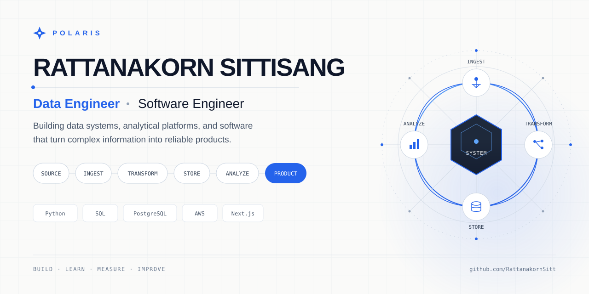
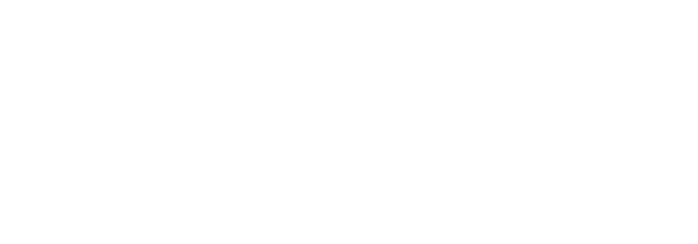
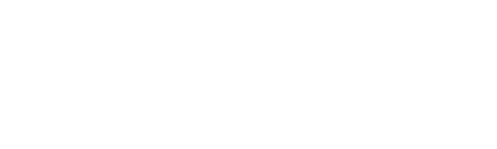

<div align="center">



# RATTANAKORN SITTISANG

### Data Engineer · Software Engineer

Building data systems, analytical platforms, and software that turn complex information into reliable products.

[GitHub](https://github.com/RattanakornSitt) · [LinkedIn](https://linkedin.com/in/rattanakorn-sittisang) · [Email](mailto:rattanakorn.sitt@gmail.com)

</div>

---

<div align="center">


</div>

## ENGINEERING FOCUS

I build across the boundary of **data engineering and software engineering** — from ingestion and transformation to storage, APIs, analytics, and production systems.

```text
SOURCE → INGEST → TRANSFORM → STORE → ANALYZE → PRODUCT
```

My approach is simple:

> **Understand the problem → design the system → build thoughtfully → measure → improve.**

---

## TECHNOLOGY

### Languages

`Python` `SQL` `TypeScript` `JavaScript` `Java`

### Data & Backend

`PostgreSQL` `Prisma` `Firebase` `Airflow` `Redis` `FastAPI` `Node.js`

### Cloud & Engineering

`AWS` `Docker` `Git` `GitHub Actions` `Linux`

### Application

`React` `Next.js` `Tailwind CSS`

---

<div align="center">


</div>

## DATA ENGINEERING

I build data workflows that move from raw sources to structured, usable information.

```text
Sources
  │
  ├── APIs
  ├── Applications
  ├── Events
  └── External Data
       │
       ▼
   Ingestion
       │
       ▼
 Transformation
       │
       ▼
    Storage
       │
       ▼
   Analytics
       │
       ▼
    Products
```

**Focus areas**

`ETL / ELT` · `Data Modeling` · `SQL Analytics` · `API Ingestion` · `Workflow Orchestration` · `Data Quality` · `Cloud Infrastructure`

---

<div align="center">


</div>

## FEATURED PROJECTS

### GitHub Analytics Platform

A data engineering platform for collecting, transforming, storing, and analyzing GitHub data.

`Python` `SQL` `PostgreSQL` `Docker` `Next.js` `TypeScript`

**[View Repository →](https://github.com/RattanakornSitt/github-analytics-platform)**

---

### Global Tech Jobs Intelligence Platform

An ETL and analytics platform that transforms job-market data into structured insights about technologies, skills, companies, and demand.

`Python` `SQL` `PostgreSQL` `AWS` `Airflow` `Next.js`

**[View Repository →](https://github.com/RattanakornSitt/global-tech-jobs-intelligence-platform)**

---

### TaskFlow Analytics

A productivity and analytics application combining structured task data, backend services, data modeling, and a modern web interface.

`Next.js` `React` `TypeScript` `PostgreSQL` `Prisma`

**[View Repository →](https://github.com/RattanakornSitt/taskflow-analytics)**

---

### Luna CLI

A developer tooling project exploring command-line architecture, automation, testing, Git workflows, and AI-assisted development.

`Python` `CLI` `Git` `Testing`

**[View Repository →](https://github.com/RattanakornSitt/luna-cli)**

---

<div align="center">


</div>

## ENGINEERING

I approach projects as systems rather than isolated features.

```text
UNDERSTAND → RESEARCH → DESIGN → BUILD → MEASURE → IMPROVE ↺
```

I care about the practices that make systems easier to build and maintain:

`Git` · `Testing` · `CI/CD` · `Docker` · `APIs` · `Architecture` · `Documentation`

---

<div align="center">



</div>

## DELIVERY

```text
CODE → TEST → BUILD → DEPLOY → MONITOR
```

The goal is not simply to make software work.

It is to make it **reproducible, observable, maintainable, and reliable**.

---

<div align="center">


</div>

## ENGINEERING ANALYTICS

I like using data to understand how systems behave.

- Reliability
- Performance
- Bottlenecks
- Trends
- Data quality
- Opportunities for automation

**Measure → Understand → Improve**

---

<div align="center">



</div>

## ENGINEERING JOURNEY

**Software → Data → Systems → Engineering**

My path has gradually moved from building applications toward understanding the systems behind them.

I’m continuing to deepen my skills in **data engineering, backend systems, cloud infrastructure, system design, and scalable software development**.

---

## CURRENTLY BUILDING

```text
▸ Data Engineering
▸ ETL / ELT Systems
▸ Analytics Platforms
▸ Backend Services
▸ Cloud Infrastructure
▸ Developer Tooling
▸ AI Applications
```

---

<div align="center">


### BUILD · LEARN · MEASURE · IMPROVE

[GitHub](https://github.com/RattanakornSitt) · [LinkedIn](https://linkedin.com/in/rattanakorn-sittisang) · [Email](mailto:rattanakorn.sitt@gmail.com)

</div>
